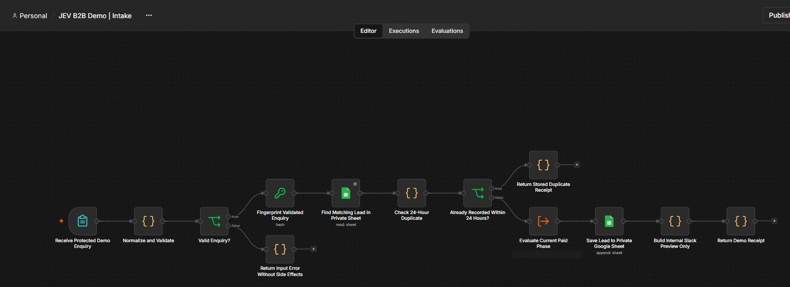
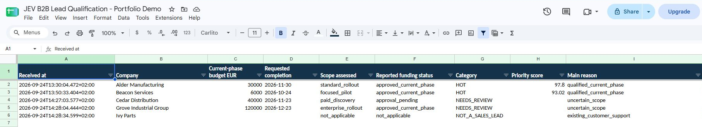
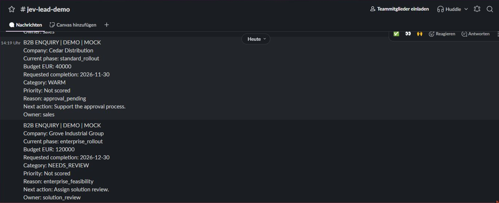
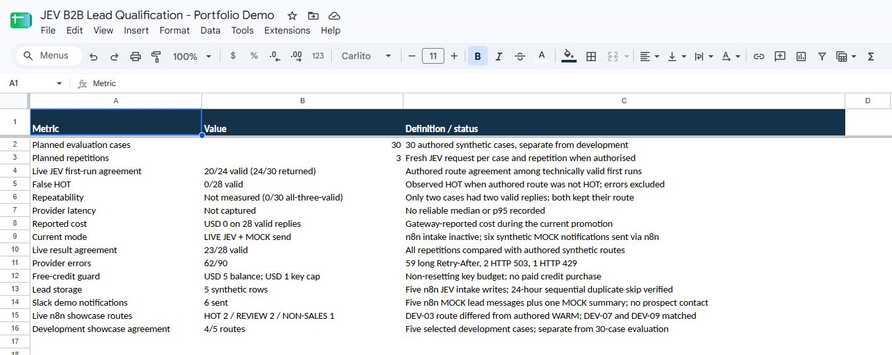

# B2B Lead Qualification with n8n + JEV

This is a synthetic portfolio demo for ClearFlow Automation, a fictional company that connects existing business software. It shows how current scope, funding and delivery gates can matter more than a large stated budget. In the live intake, an approved EUR 6,000 focused pilot was HOT while an urgent EUR 40,000 request awaiting funding went to NEEDS_REVIEW after JEV assessed its scope differently. A broken existing workflow went to support without a sales score.

## Verified status (24 September 2026)

| Component | Evidence |
|---|---|
| LOCAL POLICY TESTED | 292/292 supplied offline assertions passed |
| MOCK WORKFLOW TESTED | n8n manual execution succeeded; five synthetic cases produced the expected routes and Slack previews |
| FORM AND LIVE PIPELINE TESTED | Invalid budget was rejected; five distinct synthetic forms completed n8n JEV, Sheets append, Slack preview and receipt; four of five routes matched authored expectations |
| LIVE JEV TESTED | Native smoke and n8n integration succeeded. Evaluation campaign produced 28 valid responses from 90 planned slots; provider rate limits blocked 62 |
| SHEETS TESTED | n8n appended five synthetic leads and skipped serial duplicates; Codex Google connector read back the rows and recorded all 90 evaluation slots in `TestRuns` |
| SLACK DEMO SENT | Five n8n MOCK lead notifications and one MOCK summary reached the private demo channel in one approved sender run; the sender was relocked and remains inactive |
| EVALUATION COMPLETE | Partial: 23/28 valid live responses matched authored routes, zero false HOT; 62/90 slots had provider errors. MOCK_REPEAT 90/90; RULES ONLY 24/30 |

The [integration report](reports/integration-tests.md), [evaluation report](reports/evaluation.md) and [technical-case status](reports/technical-tests.md) identify exactly what ran. Mock answers are hand-authored test fixtures, not JEV output. No real customers or sales outcomes are represented.

## Portfolio evidence

The images below are cropped from real application screens on 24 September 2026. All visible lead names and business details are synthetic. The Slack messages show **MOCK policy outputs**; the separate Sheets rows show **live JEV intake outputs**. The two are separate runs.



| Five live JEV intake rows in Google Sheets | Approved MOCK messages delivered to Slack |
|---|---|
|  |  |



For a suggested demonstration sequence and a copy-ready English LinkedIn draft, see [Demo and LinkedIn](docs/DEMO_AND_LINKEDIN.md).

## Architecture and business policy

The intended production path is `authenticated intake → input allowlist → SHA-256 form fingerprint → 24-hour Sheets lookup → JEV native evaluate → typed-answer validation → fixed commercial gates → Google Sheets append → Slack preview/approved send`. The deployed mock showcase runs the middle policy and preview path without side effects. A separate protected Intake Preview validates form data. An inactive [Intake pipeline draft](workflows/intake-pipeline.template.sdk.js) implements the connected path and returns a stored receipt for serial duplicates. Its published source uses inert placeholders for private resource IDs. The private runtime completed five synthetic new-lead executions and two duplicate replays; public Evaluation Core source remains fail-closed. The inactive Test Runner exercises 30 mock cases three times each. [Workflow sources](workflows/README.md) are portable Workflow SDK definitions, not credential-bearing raw exports.

JEV uses the [nine typed questions](config/jev-questions.json) against only the customer message, current-phase budget, currency, requested completion and derived days, plus the trusted fictional [policy](config/policy.json). The model must not receive names, roles, case IDs, authored labels or mock answers. [Reference code](reference/policy_reference.py) validates answer shapes and applies gates in order. The [rules-only baseline](reference/rules_baseline.py) uses fixed phrase and negation rules as a transparent comparator.

Current paid-phase floors are EUR 3,000 for discovery, EUR 5,000 for a narrow pilot and EUR 15,000 for a departmental rollout. Multi-country scope and unresolved access/hosting dependencies require review. These are invented demo rules, not market prices or delivery promises. A score is shown only after the relevant gates pass; it is not a purchase probability.

## Run local checks

From this repository root with Python 3.10+:

```sh
python reference/check_offline.py
python tools/test_release_guard.py
python reference/test_jev_adapter.py
python reference/run_local.py
python tools/release_guard.py --root .
```

`run_local.py` computes routes before it joins authored labels. It reports MOCK and RULES ONLY separately. Do not interpret their agreement as live-model quality.

## Import and finish runtime setup

1. Import/build [the mock showcase](workflows/mock-showcase.sdk.js), [intake preview](workflows/intake-preview.sdk.js), [mock Test Runner](workflows/test-runner.sdk.js), [native Evaluation Core](workflows/evaluation-core.sdk.js) and [gated Intake template](workflows/intake-pipeline.template.sdk.js) using an n8n Workflow SDK capable instance. Builders are in `tools/`. Supply private core/sheet IDs to the intake builder outside the public tree. Keep forms inactive until the end-to-end path and access protection are verified. The forms use n8n user authentication.
2. Create a private Google Sheet with `Leads`, `TestRuns`, `Summary` and `Config` tabs; the required columns are in [the integration report](reports/integration-tests.md). Bind a **Google Sheets action OAuth** credential in n8n. A Codex Google connector or a Google Sheets Trigger credential does not prove an n8n write.
3. The first Gateway request returned `customer_verification_required`; a subsequent native smoke and n8n request succeeded after account setup. The authenticated account had USD 5 free credits. The dedicated key has a USD 1 non-resetting budget and the project permits USD 0 paid spending. The [Evaluation Core source](workflows/evaluation-core.sdk.js) targets `POST https://ai-gateway.vercel.sh/v1/evaluate` with `model: typesafe-ai/jev`, one allowlisted state and nine questions. Its portable source remains fail-closed. The private n8n instance temporarily holds the key in its HTTP node header; move it to an n8n HTTP credential before activation. The [native HTTP adapter](reference/jev_adapter.py) has now validated the real response shape.
4. Keep the Slack Incoming Webhook in a private sender only. One approved six-message MOCK batch was sent and verified; the private sender was immediately relocked and remains inactive. The public repository contains no webhook URL or secret-bearing sender export. [The exact sent texts](reports/slack-previews.md) remain separate from live JEV intake results. No development or evaluation loop sent Slack messages.
5. The synthetic n8n write/read, sequential duplicate replay and JEV smoke are complete. The 30×3 campaign hit provider rate limits after 28 valid replies; see [evaluation](reports/evaluation.md). Its 90 redacted result/error rows were written to the private `TestRuns` tab by the Codex Google connector, not by the n8n Test Runner. Re-run missing cases only after a later rate-limit window, with fresh credit and attempt checks.

## Limitations and security

The mock policy and evaluation loops remain side-effect-free; a separate, explicitly approved sender delivered six synthetic MOCK notifications. The inactive Intake pipeline processed five synthetic leads through JEV and Sheets and skipped serial duplicate replays, but its private Evaluation Core holds an inline key pending native credential migration. A Sheets lookup and append are not atomic: concurrent duplicate protection, stable API-key conflict handling and recovery after partial failures remain unimplemented. Provider rate limits prevented full live evaluation. No public webhook, prospect email, automatic LinkedIn post or production sales processing is enabled. Live intake remains Slack preview-only; the one MOCK send batch has completed.

Only synthetic fixtures and redacted source belong here. Do not commit credentials, private workflow exports, account URLs or raw executions. See [limitations](reports/limitations.md), [release checks](docs/PUBLIC_REPOSITORY_CHECKLIST.md) and [official references](docs/OFFICIAL_REFERENCES.md). No licence has been selected.
